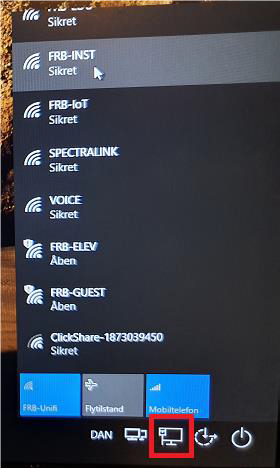

# Opret VPN-forbindelsen før Login

<p style="color: #41B883; border: 1px solid #41B883; border-radius:5px; padding: 1rem;">Manuel etablering af VPN-forbindelsen inden man logger ind på sin PC giver følgende fordele:

1.	Du får mulighed for at ændre din adgangskode hvis den er udløbet
2.	Du kan logge på PC’ere du ikke har brugt før
3.	Netværksdrev (som P-, R-, S-) er tilgængelige med det samme
4.	Computeropdateringer kommer på regelmæssigt
</p>

## Tilslut Internetforbindelse

> Dette skal typisk kun gøres én gang, derefter vil computeren automatisk oprette netværks-forbindelsen.


```js
Klik på ikonet (nederst til højre på skærmen) til 'Internet' 
Tilslut til relevant netværk (typisk et WiFi-netværk)
```

## Etabler VPN-forbindelse


```js
Klik på ikonet (nederst til højre på skærmen), der hedder 'Netværkslogon'
```


```js
'Cisco Anyconnect' vil nu automatisk etablere 'VPN-forbindelsen' 
(dette tager typisk 5-10 sekunder)
```


```js
Når VPN-forbindelsen er etableret, kommer der et nyt ikon frem
Det betyder at VPN-forbindelsen er oprettet
Herefter kan der logges ind på PC’en som normalt
```

> PS:  Der er intet i vejen for ikke at etablere VPN-forbindelsen manuelt, før man logger på PC’en, da VPN-forbindelsen vil blive etableret automatisk.  Dog vil det først ske efter man er logget ind på PC’en (dvs. når man er inde på skrivebordet) og man vil så ikke få de fordele vi har listet i starten af denne vejledning. 


