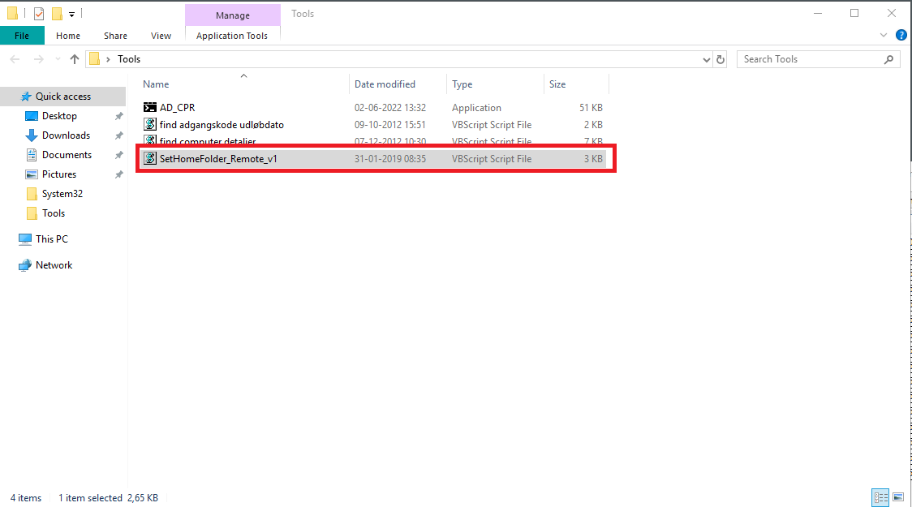
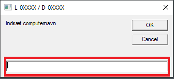
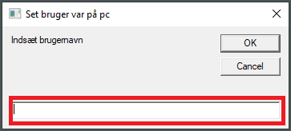
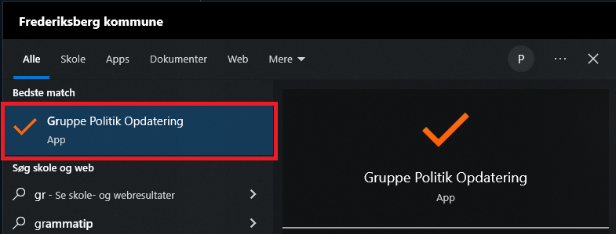

# P-drev mangler

## Script

```js
Kør script 'SetHomeFolder_Remote_v1' fra 'SRRDSADM01'
```


```js
Indsæt 'computernavn' i feltet
```


```js
Indsæt 'brugernavn' i feltet
```


```js
Kør derefter 'Gruppe Politik Opdatering' på brugerens computer
Nu vil P-drevet være synligt igen
```

## Metode 2

<p style="color: #41B883; border: 1px solid #41B883; border-radius:5px; padding: 1rem;">Enkelte gange er det ikke muligt at få P-drevet frem igen vha. scriptet. Så kan det gøres manuelt på følgende måde.</p>


```js
Søg efter brugeren i 'AD'
```


```js
Klik på 'properties'
Klik derefter på 'Profile'
Kopier stien til P-drevet
```


```js
Opret forbindelse til brugerens PC og tag styringen
Klik på 'Denne Computer' i 'Stifinder'
```


```js
Klik nu på fanen 'Computer'
Klik så på 'Tilkny netværksdrev'
```


```js
Nu kommer der et nyt vindue op
Vælg 'P:' under 'Drev'
Indsæt derefter den kopierede sti ind i 'Mappe'
Tryk så på 'Udfør'
Nu er P-drevet synligt igen
```
