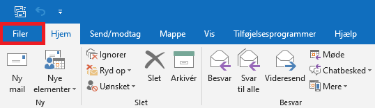
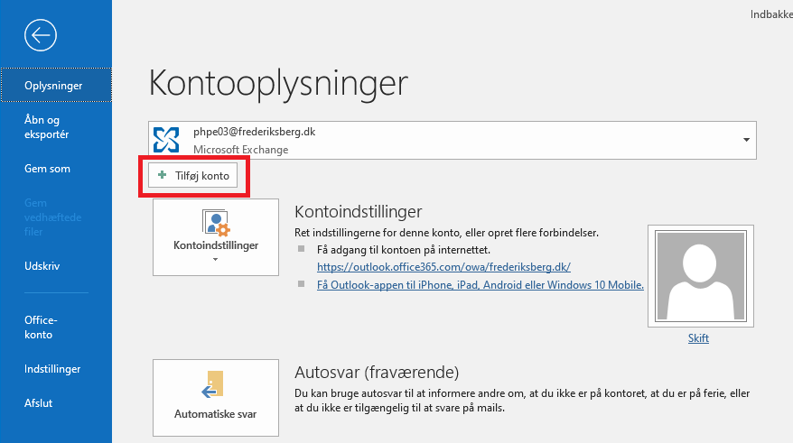
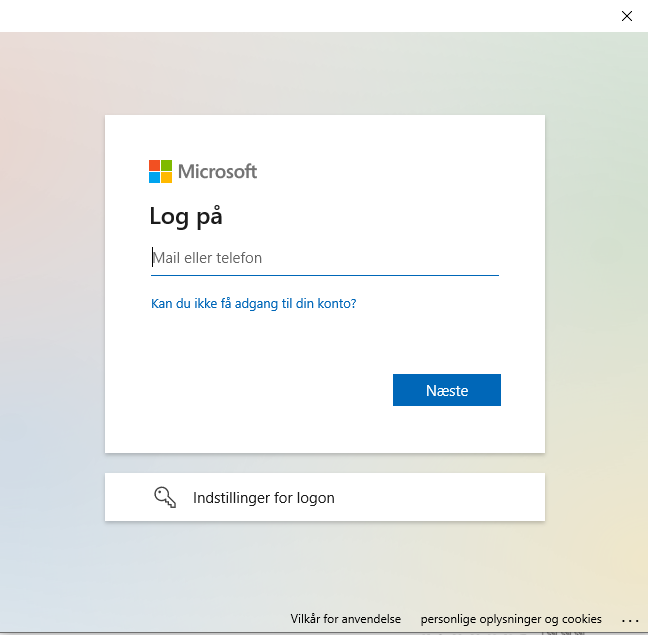

# Tilføj fællesmailkonto

<p style="color: #00CC66; border: 1px solid rgba(0, 204, 102, 1); border-radius:5px; padding: 1rem;">Denne guide er til at tilføje en fælles mailkonto</p>

---

```
Åben outlook og klik på 'Filer'
```
---

```
Vælg derefter 'Tilføj konto'
```
---

```
Indtast adressen til den mail som skal tilføjes
```
---

```
Indtast nu din egen mailadresse og login
```
```
Til sidst skal Outlook genstartes og så er mailkontoen tilføjet
```