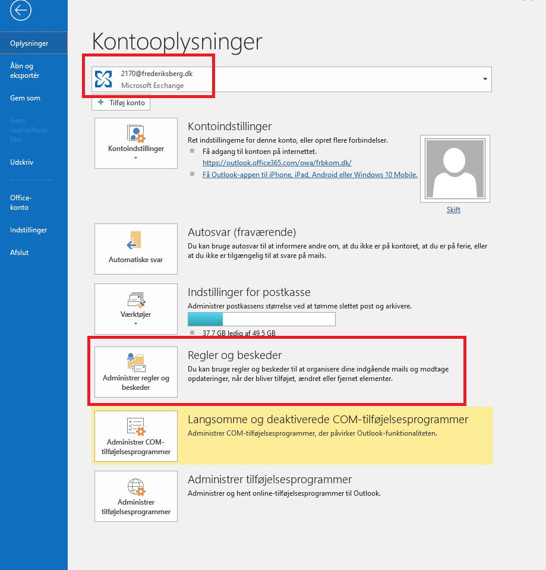
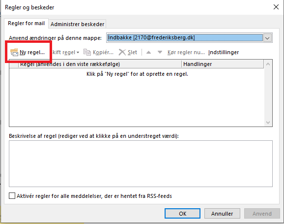
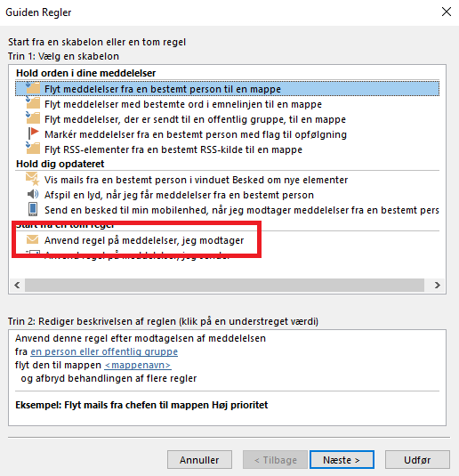
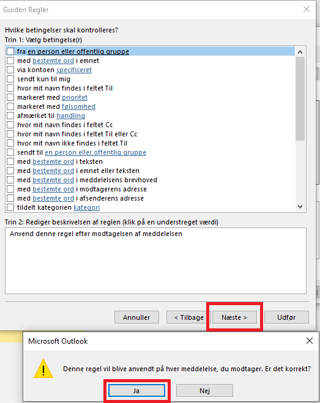
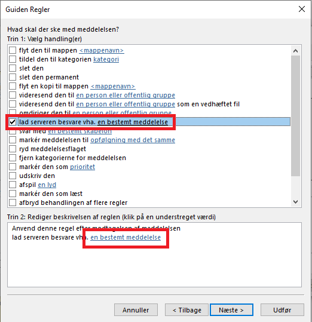
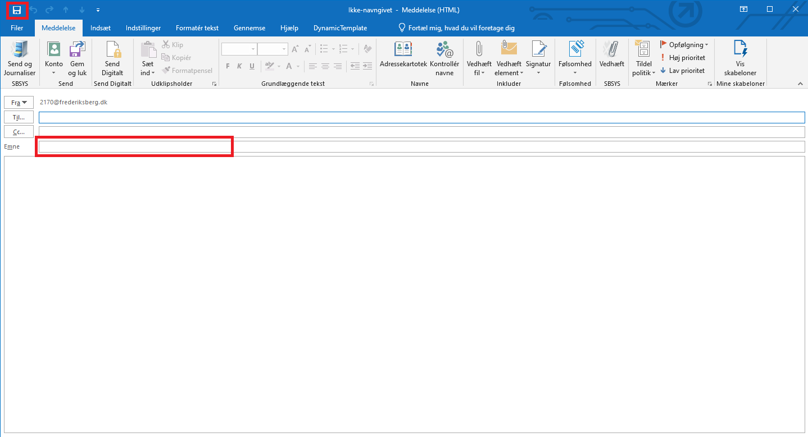
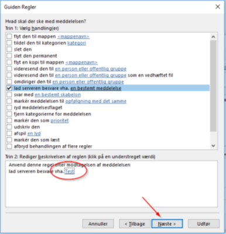
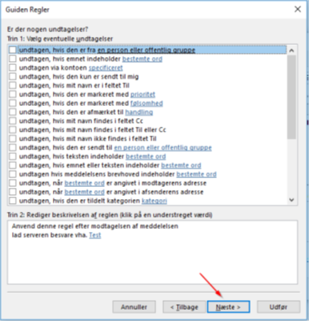
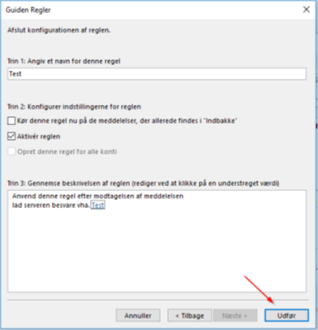
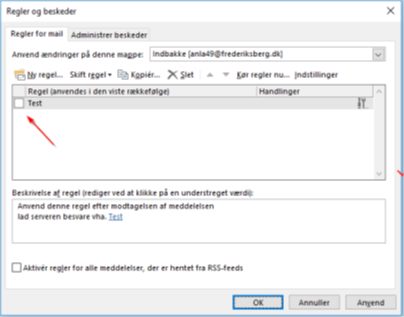

# Autosvar

---

<p style="color: #41B883; border: 1px solid #41B883; border-radius:5px; padding: 1rem;">Fordelen ved at bruge denne metoder er, at der altid sendes et svar for hver mail der modtages – uanset om det er fra samme afsender. Der kan ikke sættes en automatisk start/stop tidspunkt, så reglen skal manuelt slås til/fra.</p>

> NB: Ved at bruge det normale ”Automatiske svar”, bliver der kun sendt ét autosvar per afsender – uan-set hvor mange mails hver afsender sender. Denne metode kan selvfølgelig også bruges 



```js
Start ved at klik på 'Filer'
Vælg derefter den konto det drejer sig om
Klik på 'Administrer regler og beskeder'
```


```js
Klik på 'Ny regel...'
```


```js
Vælg 'Anvend regel på meddelelser, jeg modtager'
Og klik på 'Næste'
```


```js
Der skal IKKE sættes nogen flueben, da reglen skal gælde for ALLE indkomne mails
Klik 'Næste' 
Klik 'Ja' for at bekræfte det
```


```js
Sæt hak i 'lad serveren besvare vha. en bestem meddelelse'
Tryk på linket 'en bestemt meddelelse'
```


```js
Nu åbnes en email (skabelon). 
Der skal ikke udfyldes nogen email adresse i 'Til…'
Skriv i 'Emne' feltet og tilføj en passende tekst 
Klik på 'Gem' og 'Luk' på krydset 
```


```js
Der burde nu være et link i regelopsætningen 
Klik på 'Næste'
```


```js
Der bør ikke være nogen hak 'Undtagelser'
Klik på 'Næste' 
```


```js
Klik på 'Udfør'
Reglen træder i kraft med det samme og fungere indtil den manuelt bliver deaktiveret
```


```js
Reglen kan aktiveres/deaktiveres ved at tilføje/fjerne flueben ud for reglen 
```