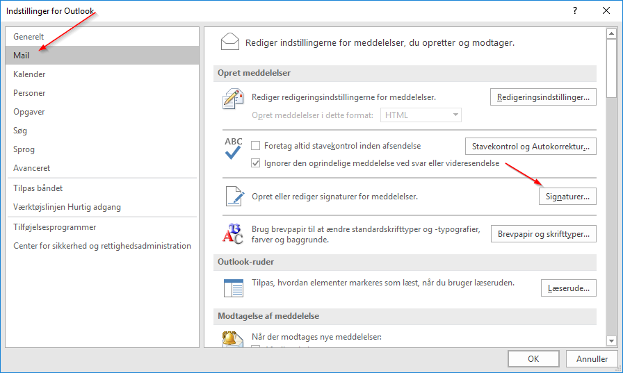
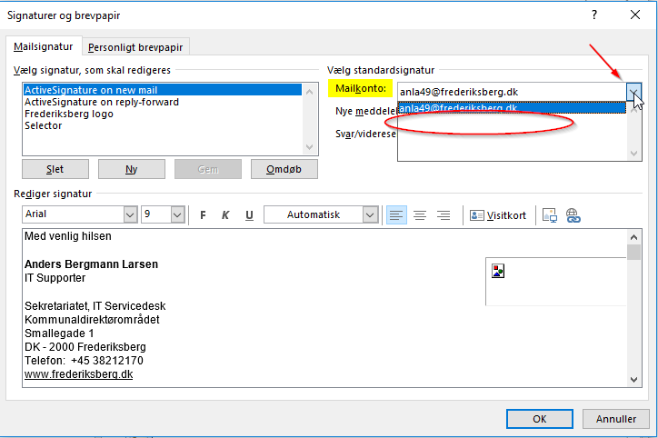
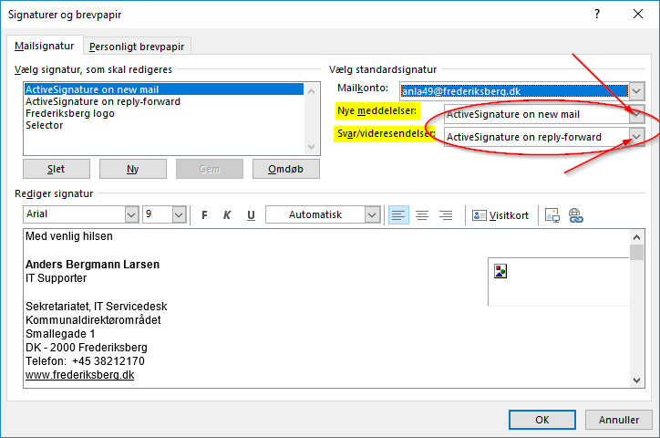

# Sådan tilføjes email signatur til en fælles postkasse 

---

<p style="color: #41B883; border: 1px solid #41B883; border-radius:5px; padding: 1rem;">Hvis fællespostkassen har været installeret tidligere på den gamle måde, skal den først fjernes og så tilføjes igen på den nye måde, før man kan tilføje sin email signatur som standard signatur.</p>


```js
1.	Klik på fanebladet 'Filer' i øverste venstre hjørne af Outlook
2.	Klik på 'Mail' og 'Signaturer…'
3.	Vælg den relevante postkasse
```


```js
4.	Vælg de relevante email signaturer for 'Nye meddelelser' & 'Svar/videresendelser'
```


```js
5.	Klik 'OK' og 'OK' for at komme tilbage til Outlook.
```