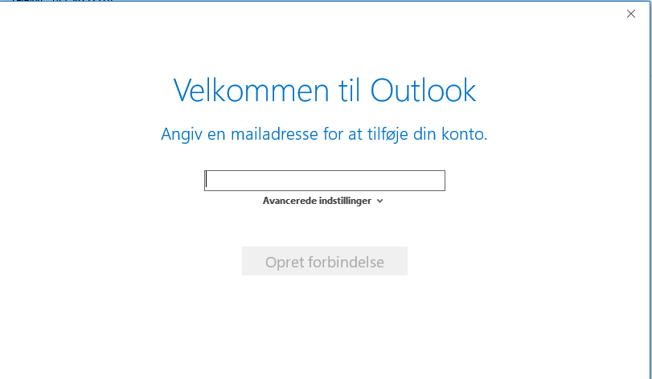
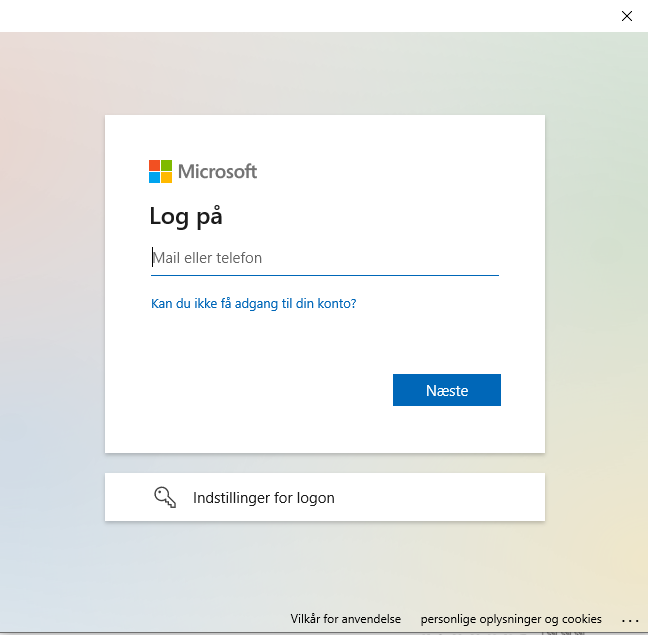

# Tilføj fællesmailkonto
---
<p style="color: #41B883; border: 1px solid #41B883; border-radius:5px; padding: 1rem;">Denne guide er til at tilføje en fælles mailkonto i Outlook.</p>


```js
Åben outlook og klik på 'Filer'
```


```js
Vælg derefter 'Tilføj konto'
```


```js
Indtast adressen til den mail som skal tilføjes
```


```js
Indtast nu din egen mailadresse og login
Til sidst skal Outlook genstartes og så er mailkontoen tilføjet
```