# Deaktiverede plugins i Outlook og Word

## Aktiver plugins

<p style="color: #41B883; border: 1px solid #41B883; border-radius:5px; padding: 1rem;">Plugins i Word og Outlook har det med at deaktivere, typisk vil det være SBSYS, Autosignatur, Send sikker og Dynamic Template.</p>


> Plugins i både Word og Outlook genaktiveres på samme måde:


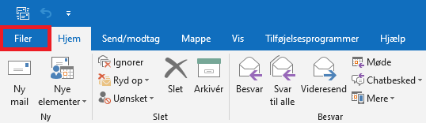
```js
Start med at tryk på 'Filer'
```

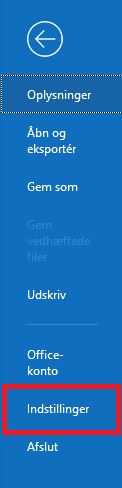
```js
Vælg derefter 'Indstillinger'
```

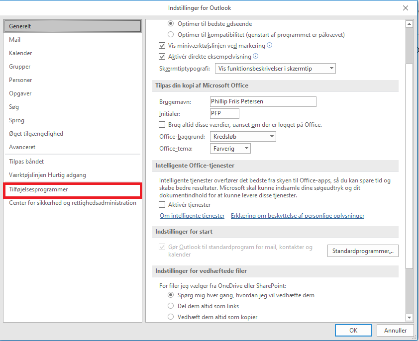
```js
Tryk på 'Tilføjelsesprogrammer'
```

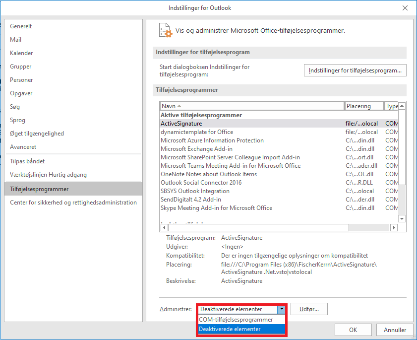
```js
Vælg 'Deaktiverede elementer' i menuen som er placeret nederst i vinduet
```

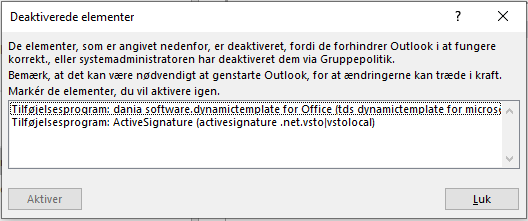
```js
Marker det deaktiverede plugin og tryk på 'Aktiver'
```

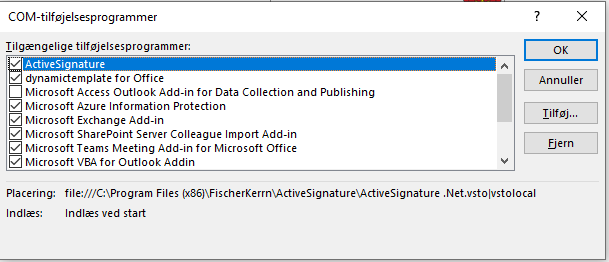
```js
Gå derefter tilbage og vælg 'COM-tilføjelsesprogrammer'
```

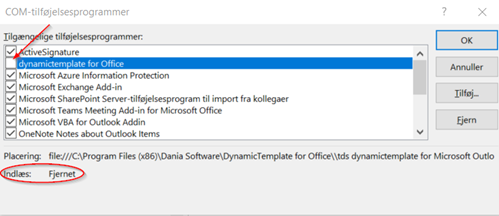
```js
Hvis det er at pluginnet står som 'Fjernet' efter aktiveringen
Så skal man yderligere ind i 'Registreringseditor' og aktivere pluginnet der også 
```


## Registreringseditor

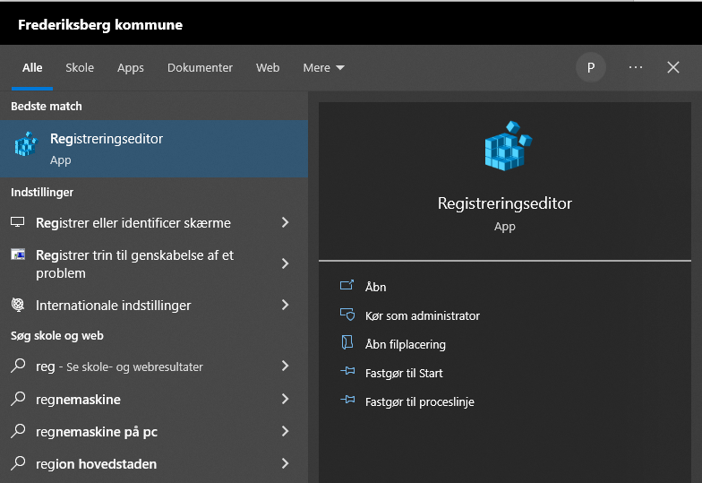
```js
Åben først 'Registreringseditor'
```

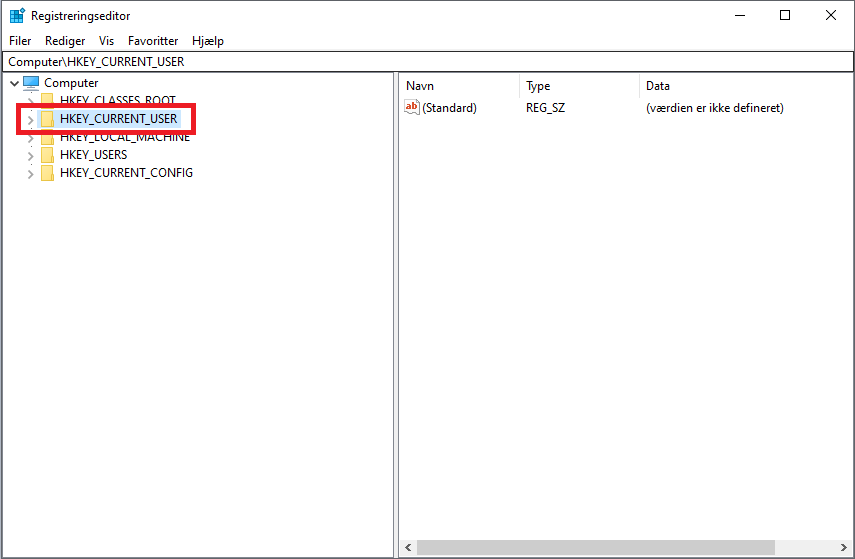
```js
Fold derefter 'HKEY_CURRENT_USER' ud
```

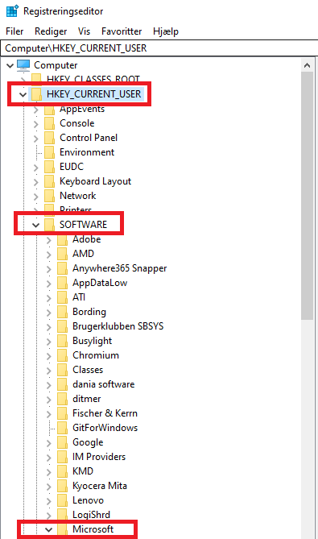
```js 
Fold så 'SOFTWARE' og 'Microsoft' ud
```

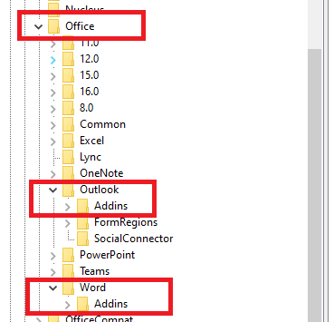
```js
Afhængigt af det pågældende plugin så fold enten 'Outlook' eller 'Word' ud
Fold så 'Addins' ud og tryk på det pågældende plugin
```

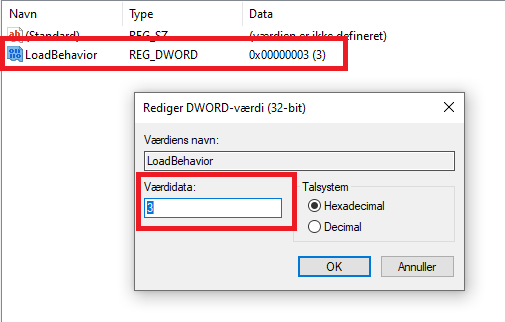
```js
Dobbeltklik på 'LoadBehavior' og sæt værdien til 3
```


