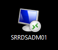
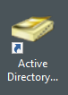
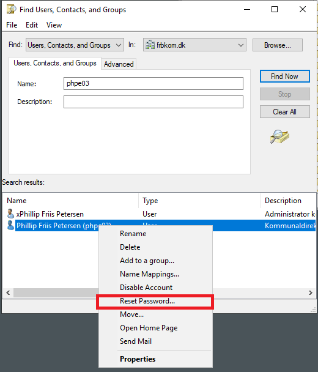
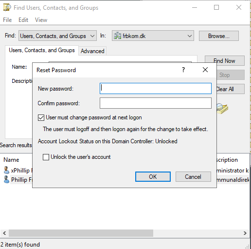
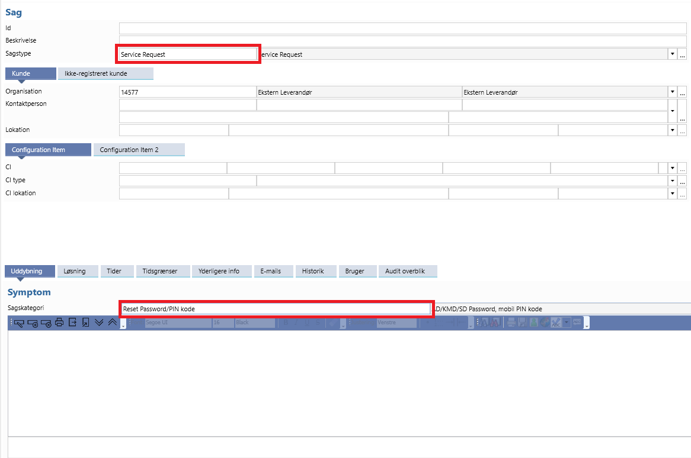

# Rest AD password

## Krav til adgangskoder

<p style="color: #41B883; border: 1px solid #41B883; border-radius:5px; padding: 1rem;">Nedenstående er de krav Frederiksberg kommune/KMD har sat på adgangskoder.  Nulstillede adgangskoder er altid midlertidige og skal skiftes af brugeren ved første login</p>

1.	Det skal være en blanding af bogstaver og tal
2.	Længden skal være mindst 12 karakterer
3.	Må ikke indeholde navn eller brugernavn
4.	Skal indeholde mindst 1 stort og 1 småt bogstav
5.  Skal indeholde tal


## Reset af Password


```js
Log først ind på Admin serveren ved at klikke på ikonet "SRRDSADM01"
```


```js
Åben derefter 'Active Directory Users and Computers'
```


```js
Højreklik på 'frbkom.dk' og vælg 'Find'
```


```js
Søg efter det ønskede brugernavn
```


```js
Højreklik på brugeren og vælg 'Reset Password...'
```


```js
Skriv dernæst en midlertidig adgangskode og giv den til brugeren
```


```js
Log sagen som 'Service Request' og 'Reset Password/PIN kode' i POB
```
---