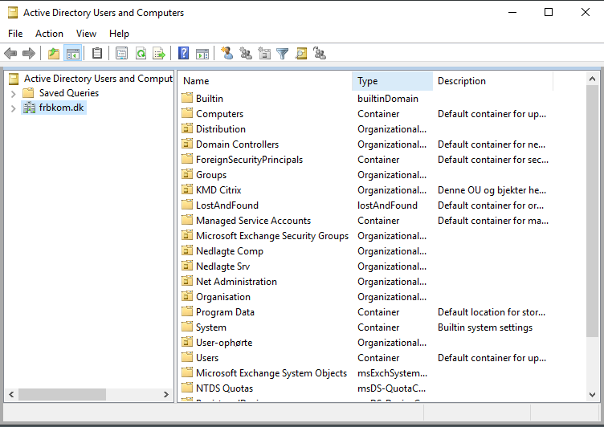

# Rest AD password

<p style="color: #00CC66; border: 1px solid rgba(0, 204, 102, 1); border-radius:5px; padding: 1rem;">Denne guide er til at nulstille brugerpasswords i AD</p>

---

```js
Log først ind på Admin serveren ved at klikke på ikonet "SRRDSADM01"
```
--- 

```js
Åben derefter 'Active Directory Users and Computers'
```
---


```js
Højreklik på 'frbkom.dk' og vælg 'Find'
```
---

```js
Søg efter det ønskede brugernavn
```
---

```js
Højreklik på brugeren og vælg 'Reset Password...'
```
---

```js
Skriv dernæst en midlertidig adgangskode og giv den til brugeren
```
---

```js
Log sagen som 'Service Request' og 'Reset Password/PIN kode' i POB
```
---