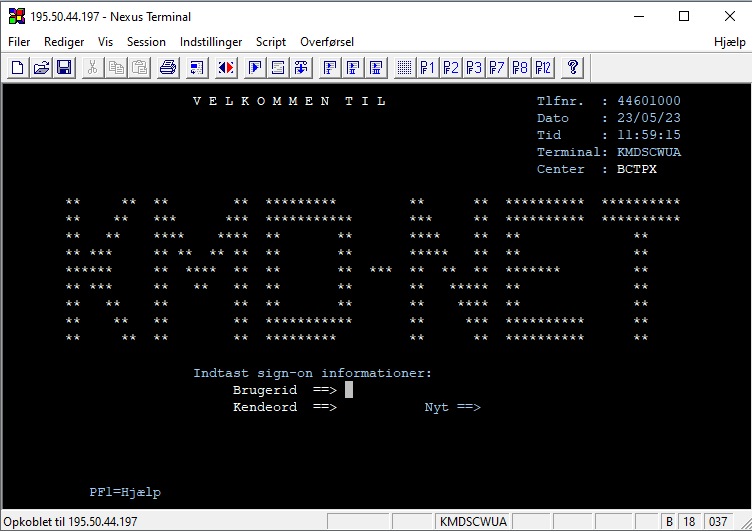
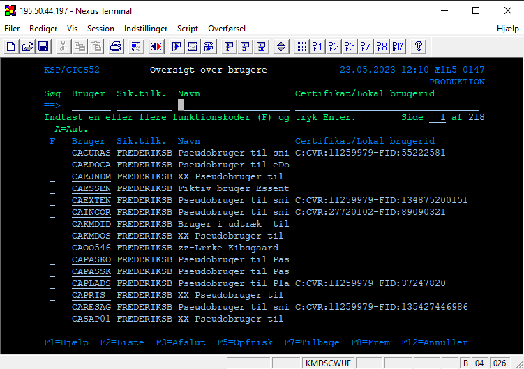

# Reset af KMD password og Find bruger


## Reset af KMD password

<p style="color: #41B883; border: 1px solid #41B883; border-radius:5px; padding: 1rem;">Denne guide er til at nulstille brugerpasswords i KMD</p>

---

```js
Søg først efter 'KMD' og åben appen
```


```js
Login med dit administrative kmd login
```


```js
Indtast 'CICS' og tryk enter
```


```js
Indtast kommandoen 'z725' for at nulstille password for en bestemt bruger
```


```js
Indtast et nyt engangskodeord og ændre Aktiv fra 'N' til 'J'
Tryk derefter Enter og så er koden nulstillet
```

## Krav til adgangskoder
Nedenstående er de krav Frederiksberg kommune/KMD har sat på adgangskoder.  Nulstillede adgangskoder er altid midlertidige og skal skiftes af brugeren ved første login.
1.	Det skal være en blanding af bogstaver og tal
2.	Længden skal være nøjagtig 8 karakterer
3.	Må ikke indeholde navn eller brugernavn
4.	Informér brugeren om den midlertidige adgangskode (enten per telefon eller email – det er god praksis ikke at inkludere loginnavn og adgangskode i samme email)

## Find KMD bruger

<p style="color: #41B883; border: 1px solid #41B883; border-radius:5px; padding: 1rem;">Hvis brugernavnet på personen skal findes, kan det gøres som nedenstående</p>

---

```js
Indtast kommandoen 'z727' for at finde bruger
```


```js
Indtast 1 for at vælge 'Ajourføring af brugeroplysninger'
```


```js
Indtast navnet for den pågældende bruger
Derefter vil brugernavnet kunne findes i venstre bjælke
```

