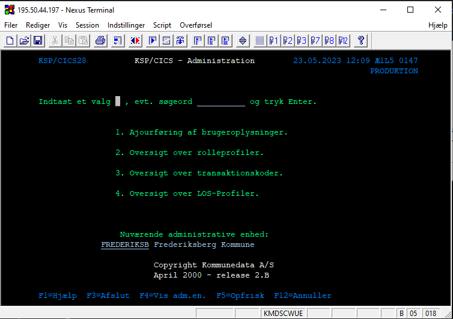

# Reset af KMD password

<p style="color: #00CC66; border: 1px solid rgba(0, 204, 102, 1); border-radius:5px; padding: 1rem;">Denne guide er til at nulstille brugerpasswords i KMD</p>

---

```
Søg først efter 'KMD' og åben appen
```
---

```
Login med dit administrative kmd login
```
---

```
Indtast 'CICS' og tryk enter
```
---

```
Indtast kommandoen 'z725' for at nulstille password for en bestemt bruger
```
---

```
Indtast et nyt engangskodeord og ændre Aktiv fra 'N' til 'J'
Tryk derefter enter og så er koden nulstillet
```
---

<p style="color: #00CC66; border: 1px solid rgba(0, 204, 102, 1); border-radius:5px; padding: 1rem;">Hvis brugernavnet på personen skal findes, kan det gøres som nedenstående</p>

---

```
Indtast kommandoen 'z727' for at finde bruger
```
---

```
Indtast '1' for at vælge 'Ajourføring af brugeroplysninger'
```
---

```
Indtast navnet for den pågældende bruger
Derefter vil brugernavnet kunne findes i venstre bjælke
```
---