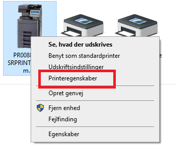
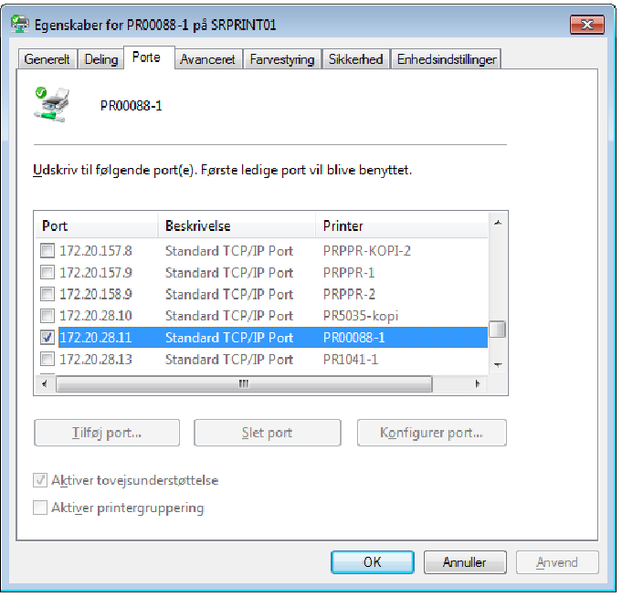
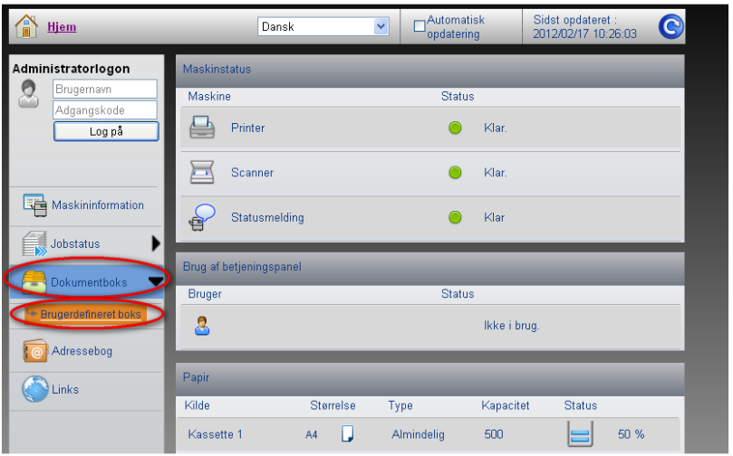
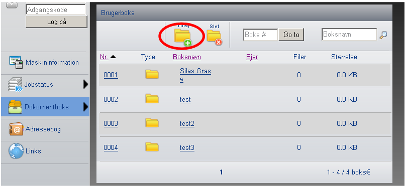
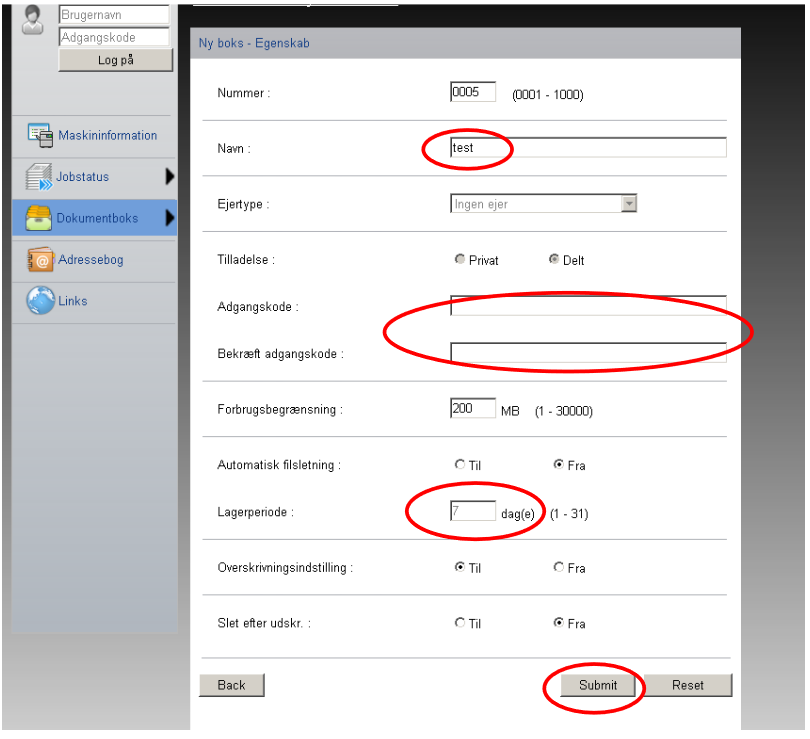
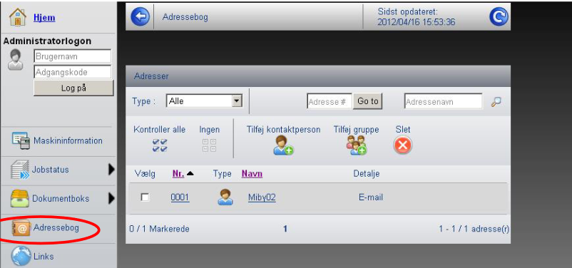
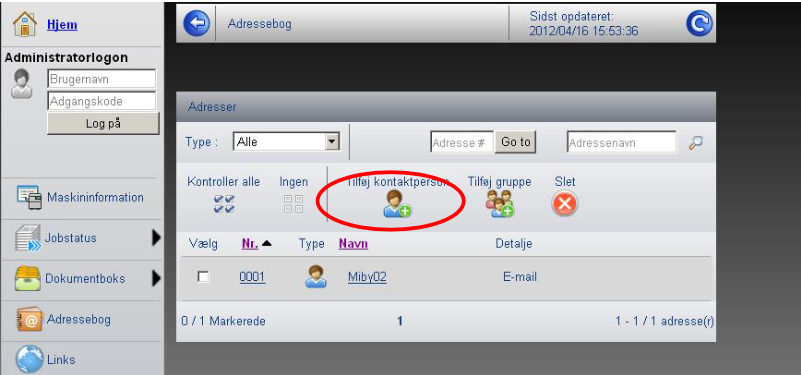
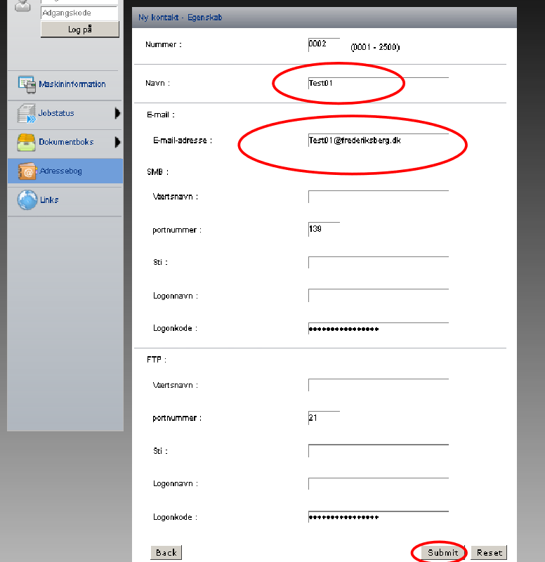

# Oprettelse af brugere på Kyocera-printer


## Oprettelse af dokumentboks


```js
Klik på 'Windows'-ikonet nederst i venstre hjørne på dit 'skrivebord'
Skriv 'kontrolpanel' i feltet og vælg 'Kontrolpanel' der kommer frem
I boksen Kontrolpanel vælg – 'Vis enheder og printere'
```


```js
Højreklik den printer der ønskes opsættes boks på og vælg 'printeregenskaber'
```


```js
Vælg fanebladet 'Porte'
Det markerede viser ip adressen under 'Port'
Åben derefter en browser og skriv ip-adressen i adressefeltet
```


```js
Tryk på 'Dokumentboks'
Og tryk derefter på 'Brugerdefineret boks'
```


```js
Tryk på 'Tilføj'
```


```js
Udfyld 'Navn' med medarbejderens fulde navn
Indtast adgangskoden
Det anbefales at sætte forbrugsbegrænsning til 1000 MB i stedet for de 200 MB
Sæt 'Automatisk filsletning' til
Sæt 'Lagerperiode' til 1
Sæt 'slet efter udskrift' til
Tryk 'Submit'

Gentag proceduren for alle de medarbejdere der skal tilføjes
```

## Oprettelse af scan to mail


```js
Tryk på 'Adressebog'
```


```js
Tryk på 'Tilføj kontaktperson'
```


```js
Udfyld 'Navn' med medarbejderens fulde navn
Udfyld 'E-mail-adresse' med medarbejderens mailadresse
Tryk på 'Submit'
```