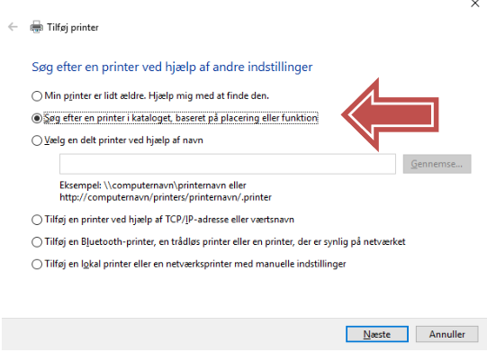

# Installering af netværksprinter


```js
1.  Klik på 'Windows'-ikonet nederst i venstre hjørne på dit 'skrivebord'
2.  Skriv 'kontrolpanel' i feltet og vælg 'Kontrolpanel' der kommer frem
3.  I boksen Kontrolpanel vælg – 'Vis enheder og printere'
4.  Vælg 'Tilføj en printer'
```


```js
Vælg 'Den printer, jeg søger efter, findes ikke på listen' og tryk på 'Næste'
```


```js
Vælg 'Søg efter en printer i kataloget, baseret på placering og funktion'
Tryk derefter på 'Næste'
```


```js
Skriv printershare-navnet i feltet 'Navn' (fx PR3025-1)
Kender man noget af printershare-navnet kan man skrive og trykke på 'Søg nu'

Under Søgeresultater kommer printeren frem
Find printeren på listen
Dobbeltklik på den printer du ønsker at installere
Printeren er nu installeret på din pc
```