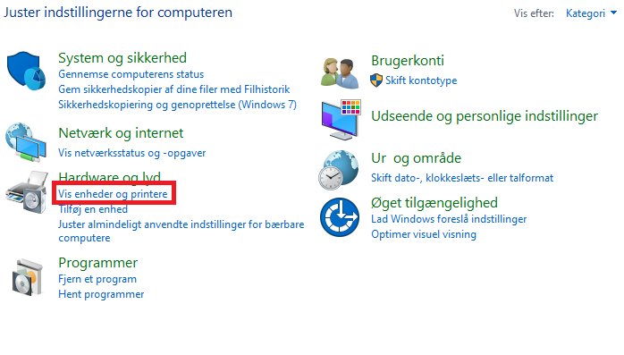

# Oprettelse af print til boks

---

<p style="color: #41B883; border: 1px solid #41B883; border-radius:5px; padding: 1rem;">Bemærk at printeren først skal være installeret på computeren.</p>


```js
1.  Klik på 'Windows'-ikonet nederst i venstre hjørne på dit 'skrivebord'
2.  Skriv 'kontrolpanel' i feltet og vælg 'Kontrolpanel' der kommer frem
3.  I boksen Kontrolpanel vælg – 'Vis enheder og printere'
```


```js
4.  Højreklik på printerikonet og vælg 'Udskriftsindstillinger'
```


```js
5.  Klik på faneblad 'job'
6.  Sæt hak i 'Joblagring' og vælg 'brugerdefineret boks'
7.  klik på 'indstillinger'
```


```js
8.  Sæt hak i 'Brug det angivne boksnummer'
9.  Angiv boksnummer og adgangskoden
10. Klik 'OK'
```
