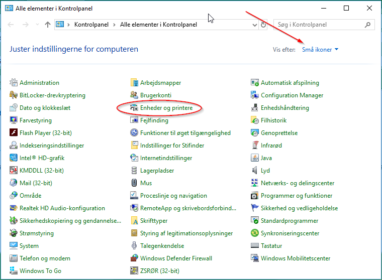
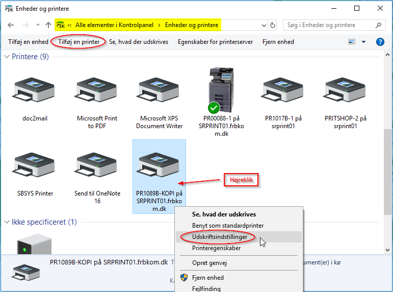
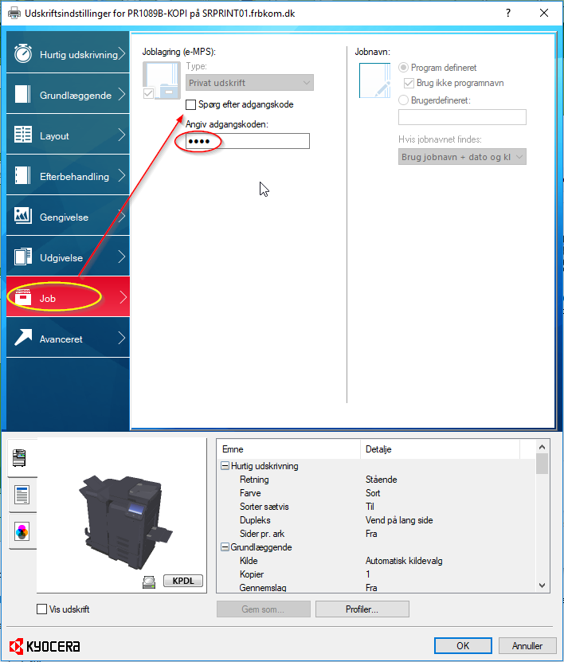
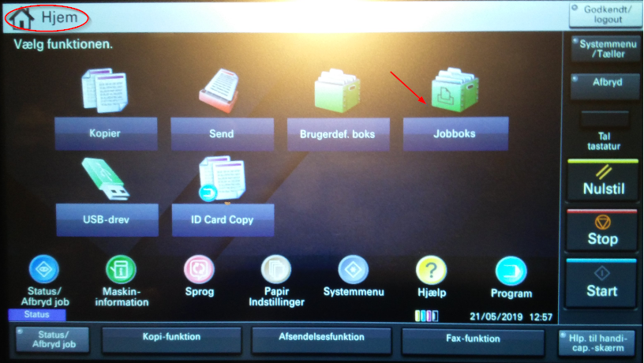
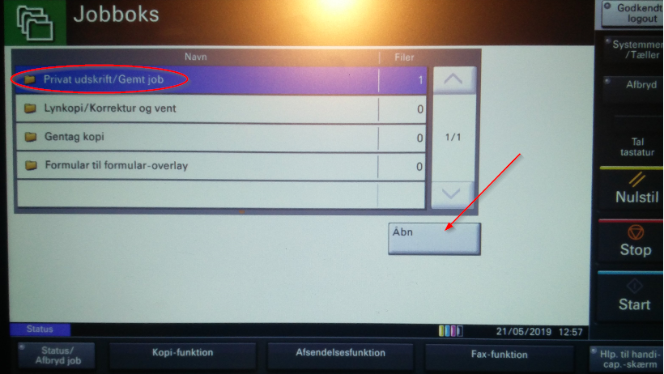
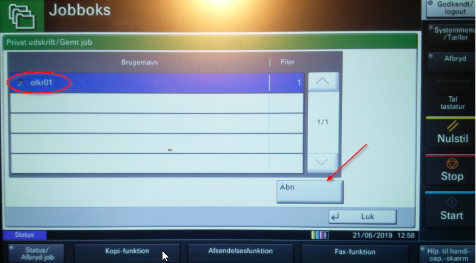

# Privat udskrift

<p style="color: #41B883; border: 1px solid #41B883; border-radius:5px; padding: 1rem;">'Privat udskrift' fungerer på samme måde som 'Brugerdefineret boks', men adskiller sig ved at der ikke skal oprettes nogen brugere på selve printeren. Det er derfor nemmere at administrere.</p>

## Oprettelse af privat udskrift


```js
1.	Åbn 'Kontrolpanel'
2.	Vælg at vise efter 'Små ikoner'
3.	Åbn 'Enheder og printere'
```


```js
4.	Højreklik på det relevante printerikon og vælg 'Udskriftsindstillinger'
```


```js
5.	Klik på fanebladet 'Job'
6.	Fjern hak i 'Spørg efter adgangskode'
7.	Angiv din egen 4-cifrede PIN-kode
8.	Klik på 'OK'

Herefter vil alle udskriftsjob automatisk anvende din valgte PIN-kode, 
som så skal indtastes ude på selve printeren.
```

## Sådan gør du på selve printeren

> Billederne nedenfor kan variere lidt, afhængig af printermodel.


```js
1.	Vælg 'Jobboks'
```


```js
2.	Vælg 'Privat udskrift/Gemt job' og klik 'Åbn'
```


```js
3.	Vælg din bruger og klik 'Åbn'
4.	Derefter kan du vælge at udskrive de dokumenter du har sendt til udskrivning. 
    Hér bliver du bedt om at indtaste din 4-cifrede PIN-kode.
```