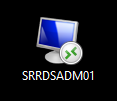

# Rest AD password

<p style="color: #00CC66; border: 1px solid rgba(0, 204, 102, 1); border-radius:5px; padding: 1rem;">Denne guide er til at nulstille brugerpasswords i AD</p>


```
Log først ind på Admin serveren ved at klikke på ikonet "SRRDSADM01"
```


```
Åben derefter 'Active Directory Users and Computers'
```


```
Højreklik på 'frbkom.dk' og vælg 'Find'
```

