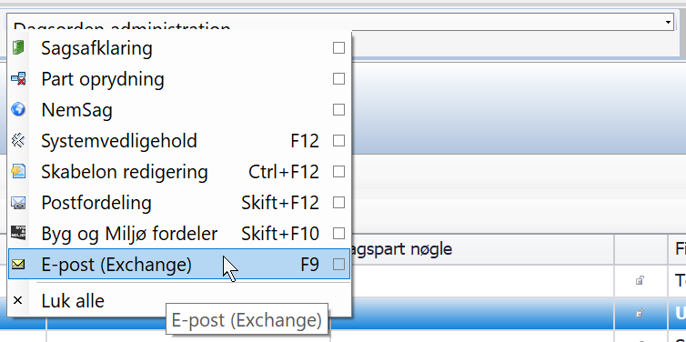
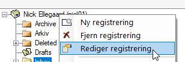
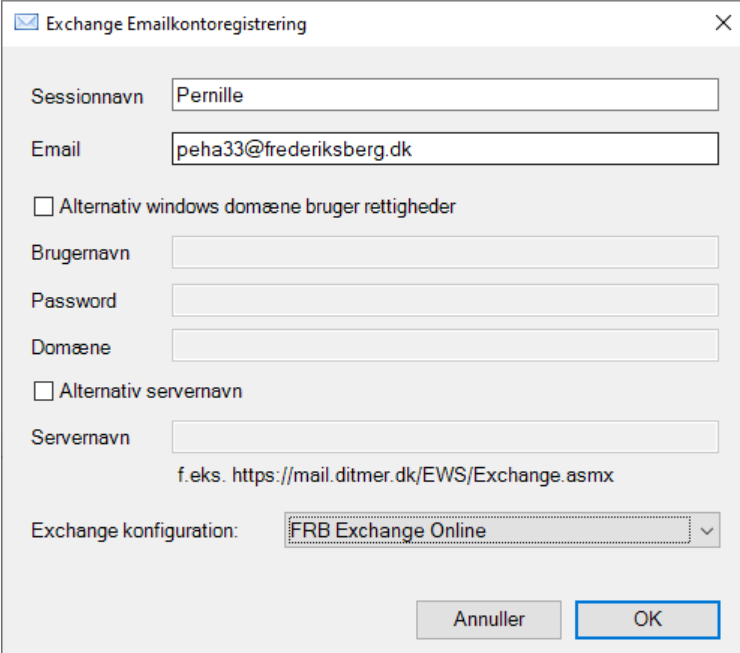

# Mailboks opsætning i SBSYS


```js
Vælg 'E-post (Exchange)' under 'funktioner' (øverst til højre)
```


```js
Højreklik mailboksen i SBSYS og vælg 'Rediger registrering'
```


```js
Opsæt felterne i stil med ovenstående
Det skal være dit brugernavn og password (det du også bruger til din computer)
HUSK at vælg 'FRB Exchange Online' under 'Exchange konfiguration'
```