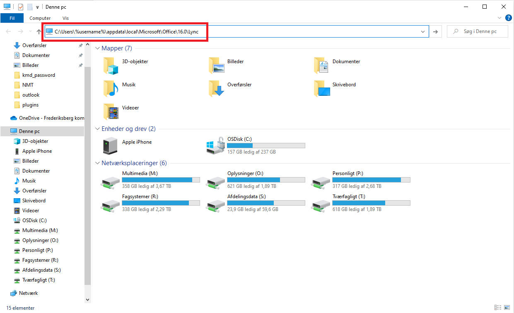
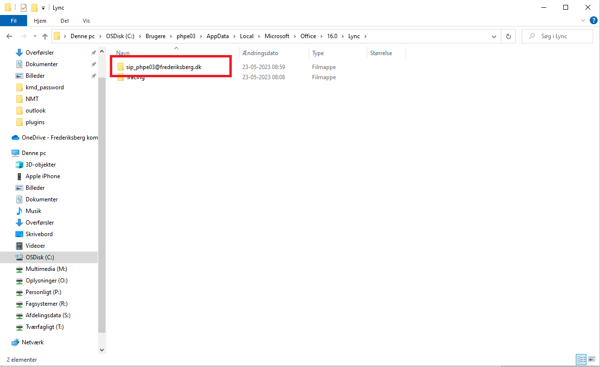

# Nulstilling af Skype Profil

---

<p style="color: #41B883; border: 1px solid #41B883; border-radius:5px; padding: 1rem;">Denne guide er til at nulstille brugerprofiler i Skype</p>



```js
Åben stifinder 
Indsæt følgende i adressefeltet:
'C:\users\%username%\appdata\local\microsoft\office\16.0\lync' 
```


```js
Luk Skype 
Slet derefter mappen:
'sip_BRUGER@frederiksberg.dk'
```

